# Functional Workflow — DAVV IET Student Lifecycle Portal

This document describes **what the system does** and **how a user moves through it**, with flowcharts. The diagrams use [Mermaid](https://mermaid.js.org/) and render automatically on GitHub.

> Companion docs: [TECHNICAL_OVERVIEW.md](TECHNICAL_OVERVIEW.md) (how it's built), [ARCHITECTURE.md](ARCHITECTURE.md) (folder map), [GLOSSARY.md](GLOSSARY.md) (DAVV terms), [../DEVELOPER_RULES.md](../DEVELOPER_RULES.md) (coding rules).

---

## 1. Actors & portals

Three roles, each with its own portal behind a single login. Admins additionally have **sub-roles** whose access is controlled by an editable permission matrix.

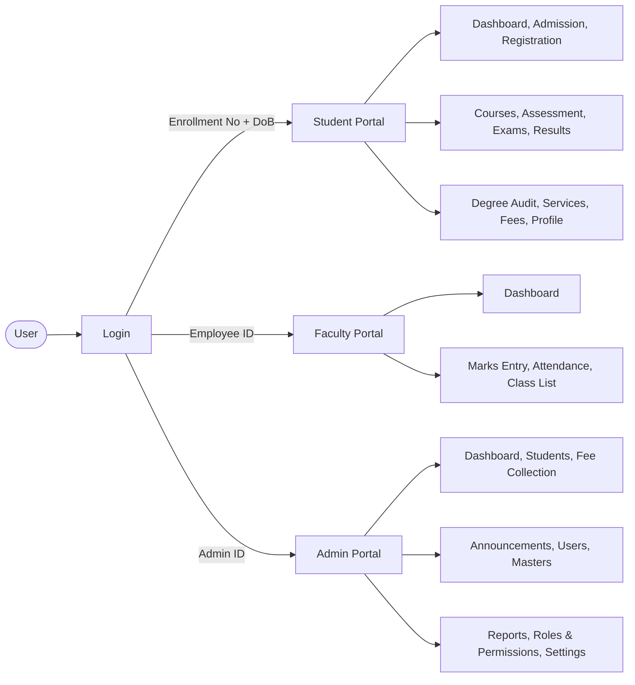

---

## 2. Login & role routing

Login is a mock identity check against seeded users. The session (role + user id) is stored in the browser and drives which portal shell loads.

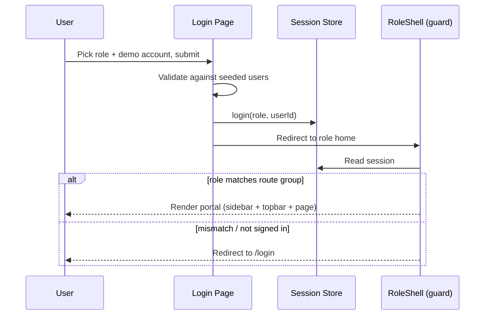

---

## 3. The complete student lifecycle

The spine of the product: from admission all the way to the degree, with the recurring per-semester loop in the middle.

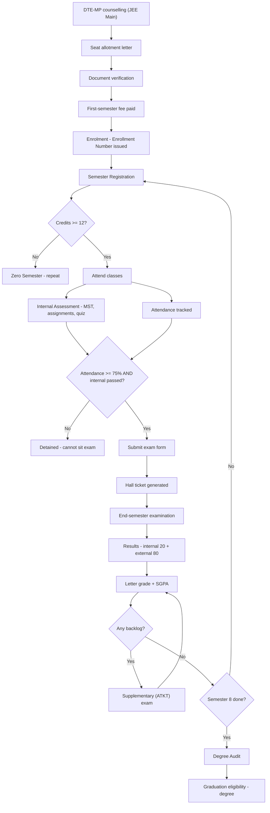

---

## 4. Registration & CBCS credits

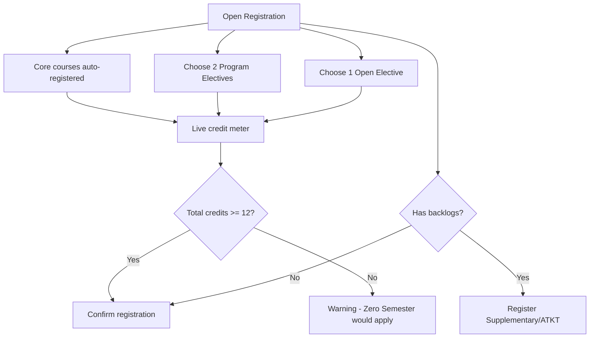

---

## 5. Exam eligibility → hall ticket

The eligibility gate is the rule that makes the "at-risk student" journey meaningful.

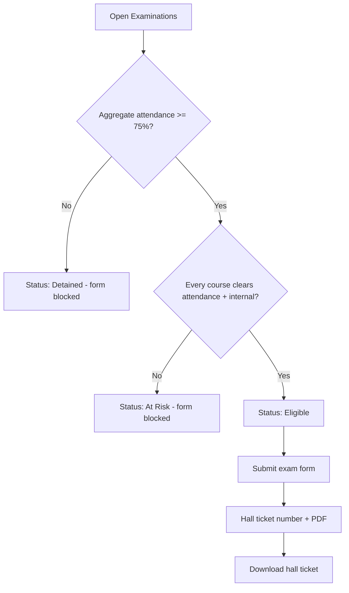

---

## 6. Results, SGPA/CGPA & degree audit

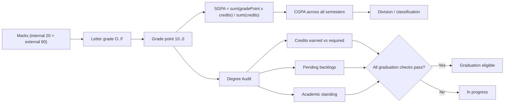

---

## 7. In-app fee payment (in-house)

Payment is handled inside the portal — no external redirect. All charging goes through one swappable service (`lib/payments.ts`) so a real gateway can replace the mock without touching screens.

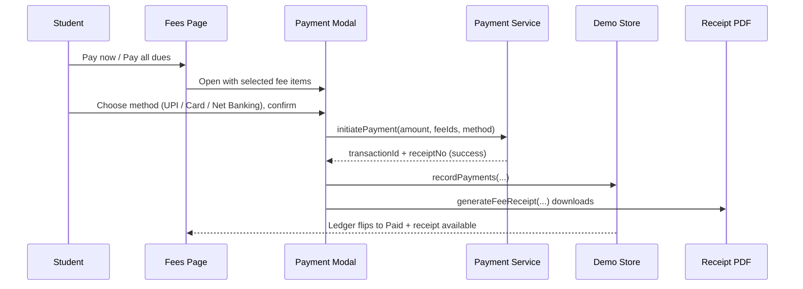

Admins can also record counter payments from **Fee Collection → Mark paid**, which uses the same service and store.

---

## 8. Student services (certificates)

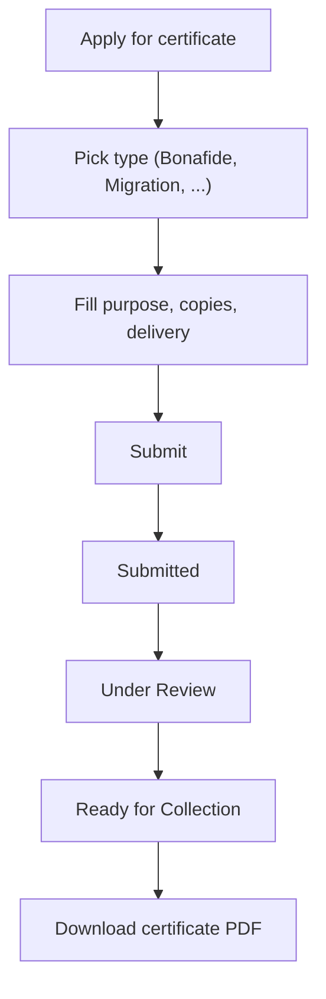

---

## 9. Faculty marks → student reflection

The one cross-role data flow: a faculty entry appears on the student's record, computed identically on both sides.

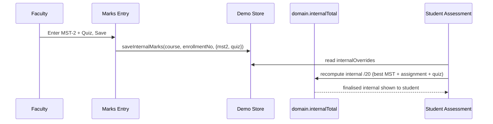

---

## 10. Admin — permissions & navigation gating

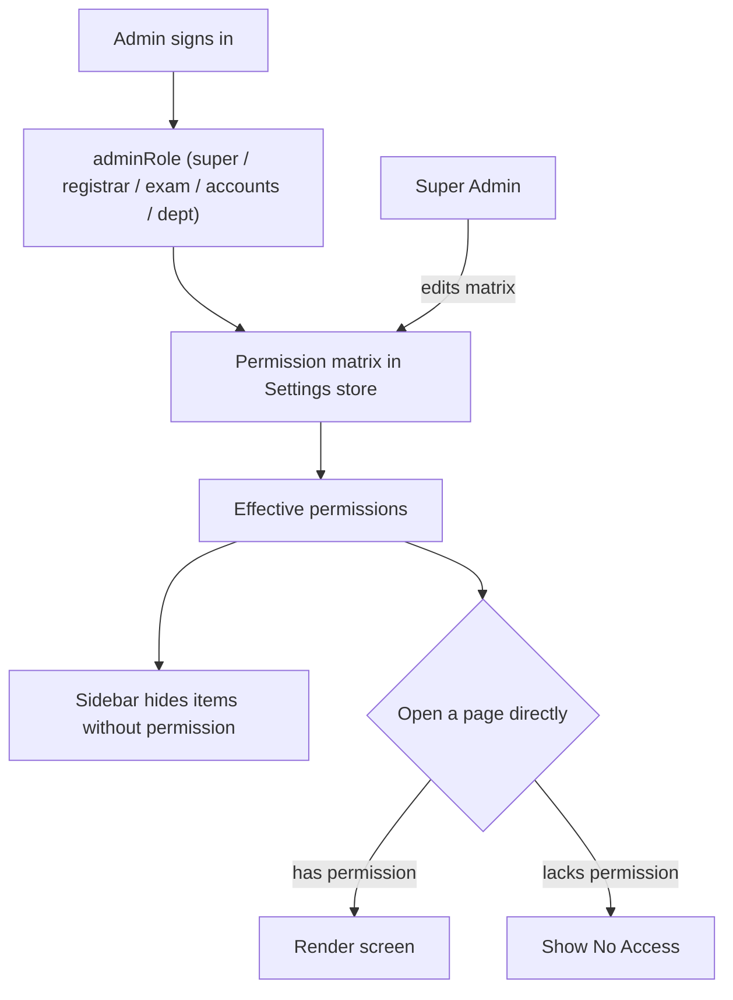

---

## 11. Admin — bulk student import

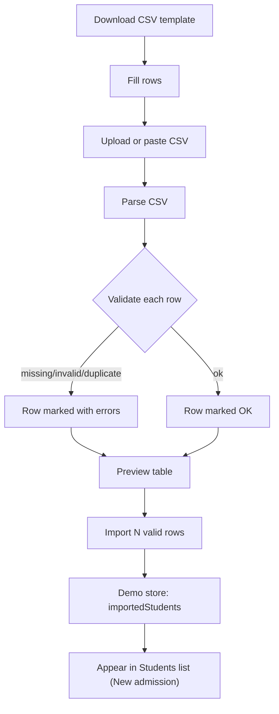

---

## 12. Admin — announcements broadcast

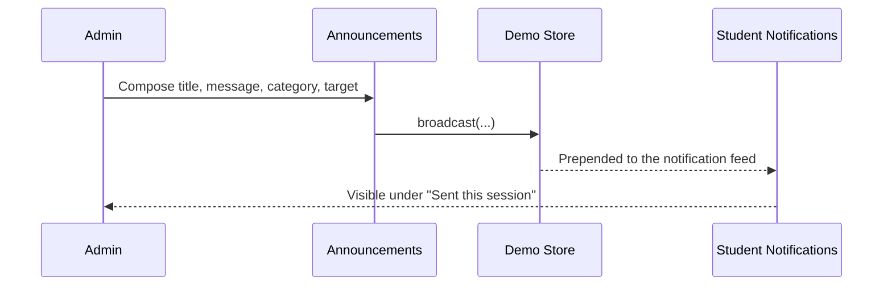

---

## 13. Data & state flow

How static seed data and runtime state combine to render a screen. Seed data is the source of truth; stores layer live changes on top.

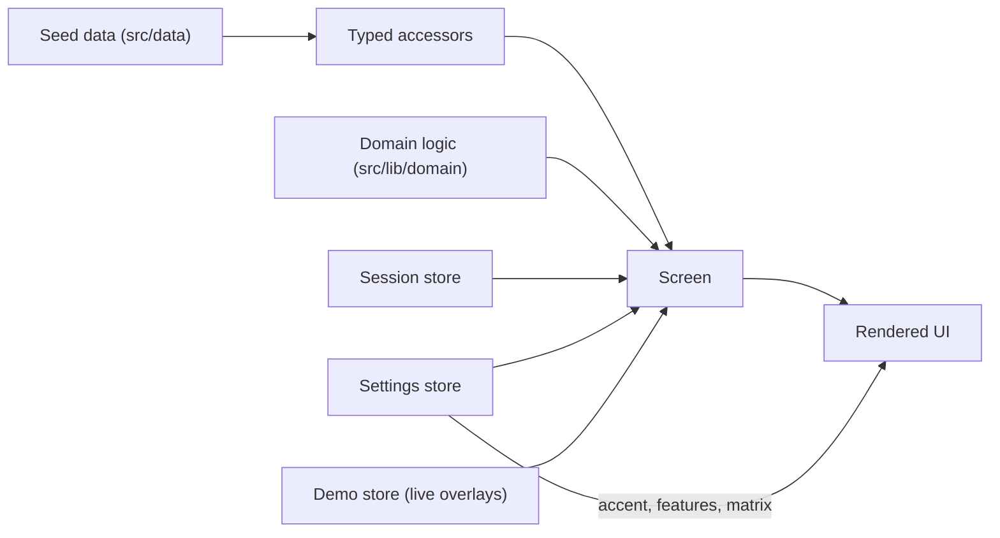

---

## 14. Feature ↔ permission map

| Admin section | Permission | Roles (default) |
|---|---|---|
| Students (view) | `students.view` | all |
| Students (deactivate) | `students.manage` | Super, Registrar |
| Bulk import | `students.import` | Super, Registrar |
| Faculty management | `faculty.manage` | Super, Registrar |
| Fee Collection (view) | `fees.view` | Super, Accounts |
| Mark paid / verify | `fees.manage` | Super, Accounts |
| Masters editor | `masters.edit` | Super, Registrar, Exam |
| Announcements | `announcements.send` | Super, Registrar, Exam, Dept |
| Settings | `settings.edit` | Super |
| Roles & Permissions | `roles.edit` | Super |
| Reports | `reports.view` | all |

Student modules **Fees**, **Student Services** and **Notifications** can additionally be toggled on/off portal-wide from **Admin → Settings**, which shows/hides them in the student navigation.
