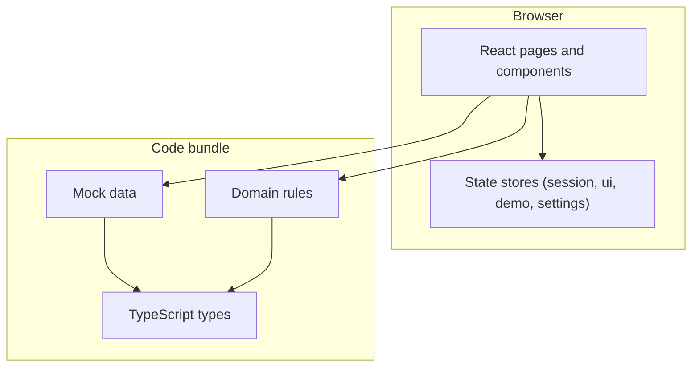

# Technical Overview — in plain language

This explains **what we built and how it works technically**, written so a developer new to the project (or an AI assistant helping on it) can understand the whole thing quickly. No prior context assumed.

> See also: [FUNCTIONAL_WORKFLOW.md](FUNCTIONAL_WORKFLOW.md) (flowcharts), [ARCHITECTURE.md](ARCHITECTURE.md) (folder map), [../DEVELOPER_RULES.md](../DEVELOPER_RULES.md) (rules).

---

## 1. What this project is

A **website prototype** of the "Student Lifecycle" for DAVV Indore's Institute of Engineering & Technology (IET) — everything a student does from admission to degree, plus the faculty and admin sides.

Two important facts shape every technical decision:

1. **There is no backend / server / database.** All the data is fake ("mock") and lives inside the code. The whole thing is a *front-end only* app.
2. **It's a static site.** When we "build" it, we get a folder of plain HTML/CSS/JS files that can be uploaded to any host (GitHub Pages, Netlify, S3). Nothing runs on a server.

Think of it as a very realistic, clickable, fully-designed **demo** — not yet a live system, but built cleanly so a real backend can be plugged in later.

---

## 2. The big picture



Everything happens in the browser. The "data" and "rules" are just JavaScript modules shipped with the page.

---

## 3. The tech stack (and why)

| Tool | What it is | Why we use it |
|---|---|---|
| **Next.js (App Router)** | React framework | Gives us file-based routing and a clean way to export a static site. |
| **React 19** | UI library | Build the interface from reusable components. |
| **TypeScript** | JavaScript + types | Catches mistakes early and documents the shape of data (a "Student" has these fields). |
| **Tailwind CSS v4** | Utility CSS | Style with classes like `bg-navy`; all colours come from one token file. |
| **Zustand** | State manager | Tiny, simple store for "who's logged in", UI prefs, and live demo actions. |
| **lucide-react** | Icons | Consistent stroke icons. |
| **jsPDF** | PDF generator | Make hall tickets, certificates and fee receipts in the browser. |

No database, no server framework, no API layer — on purpose.

---

## 4. How the code is organized

Everything lives under `src/`. The golden idea is **each kind of thing has one home**:

```
src/
  app/         The pages (URLs). Grouped by role: (student), (faculty), (admin), (auth).
  components/  Reusable UI: ui/ (buttons, cards...), shared/ (logo, charts...), layout/ (shell).
  features/    Bigger feature-specific pieces (e.g. the fee PaymentModal, bulk-import modal).
  lib/         Logic with no UI: domain/ (rules), auth/, i18n/, utils/, payments.ts, pdf.ts.
  data/        The mock data + functions to read it.
  store/       Zustand stores: session, ui, demo, settings.
  types/       TypeScript shapes for all data.
  config/      Navigation menu + site constants.
```

Rule of thumb for imports: **pages use components; components use lib/data/store; everything uses types.** Lower layers never import from higher ones.

---

## 5. How a page actually works

1. You visit a URL, e.g. `/dashboard`. Next.js matches it to `src/app/(student)/dashboard/page.tsx`.
2. That file is wrapped by a **layout** (`(student)/layout.tsx`) which renders the **RoleShell** — the sidebar, top bar and footer.
3. RoleShell first checks the **session** ("are you a signed-in student?"). If not, it redirects to `/login`.
4. The page reads its data through **accessors** (e.g. `getStudent(id)`), calculates things with **domain functions** (e.g. `computeCGPA`), and renders **components**.

Because it's a **static export**, all pages are pre-rendered to HTML at build time. There's no server deciding things per request — the browser does everything after the page loads. That's why guards and redirects run on the client (after the page mounts).

---

## 6. The four "brains"

Most of the important logic is in four places. Keep them separate and the app stays easy to change.

- **`types/`** — the *shapes*. "A `Student` has an enrollmentNo, name, semesters, fees…". This is the contract everything agrees on.
- **`data/`** — the *fake database*. Arrays of students, courses, faculty, etc., plus small functions like `getStudent()` and `studentsForCourse()`. Screens always go through these functions, never the raw arrays. Swap these functions for real API calls later and the UI won't change.
- **`lib/domain/`** — the *rules*. Pure functions with no React: grade points, `computeSGPA`/`computeCGPA`, credit totals, `examEligibility`, the permissions matrix. This is the single source of truth for "how DAVV works". If a rule is wrong, you fix it here once.
- **`store/`** — the *live state*. What changes while you use the app (see next section).

---

## 7. State management (the stores)

Zustand stores are little boxes of state with functions to change them. We have four:

- **`session`** (saved to localStorage) — who is logged in: `role` + `userId`. Survives refresh.
- **`ui`** (saved) — language, sidebar open/closed, and pop-up **toasts**.
- **`settings`** (saved) — admin-editable portal config: institute name, current semester, fee amounts, attendance threshold, **accent colour**, **feature toggles**, and the **permission matrix**. Changing these updates the app live.
- **`demo`** (in memory only) — the "make it feel alive" layer. It holds changes you make during a session that sit *on top of* the seed data: notifications read, certificate requests, exam-form submissions, faculty marks, **fee payments**, **imported students**, deactivated users, announcements. It resets on refresh so the seed data stays the source of truth.

**Key idea:** screens read seed data **and** the demo overlay, then merge them. Example: a fee is "Paid" if the seed says so *or* the demo store recorded a payment for it.

---

## 8. Login, roles & permissions

- **Login** is a mock check: pick a role and a demo account; if it matches a seeded user, we save `{role, userId}` in the session store. (No passwords — it's a prototype.)
- **RoleShell** guards each portal: if your role doesn't match the area, it bounces you to `/login`.
- **Admins have sub-roles** (Super, Registrar, Exam, Accounts, Dept). Each sub-role maps to a set of **permissions** (like `fees.view`, `students.import`). This mapping — the **matrix** — lives in the settings store and a Super Admin can edit it live.
- Two hooks do the work: `useAdminPermissions()` (what can I do?) and `useHasPermission('x')` (can I do this one thing?). The sidebar hides menu items you can't access, and each admin page shows a "No Access" card if opened without permission.

This is **UX-level access control**, not real security (there's no server to enforce it). A real deployment must enforce permissions on the backend.

---

## 9. Design system & theming

- All colours, fonts, radii and shadows are defined **once** as tokens in `src/app/globals.css` (a Tailwind v4 `@theme` block). That's why you write `bg-navy` or `text-gold` instead of hex codes.
- **Live theming:** the admin "accent colour" works by overriding the `--color-gold` token on the page at runtime (`AccentStyle.tsx`). Because every `*-gold` class points at that token, the whole app re-colours instantly.
- Reusable building blocks live in `components/ui` (Button, Card, Section, Table, Modal, Badge, Field…) and `components/shared` (Logo, StatCard, GradeBadge, Sparkline, Gauge, HeroBanner…). Build screens by composing these, not by writing raw markup.
- **Charts** (SGPA sparkline, attendance/degree gauges) are hand-drawn SVG components — no chart library, so the bundle stays small and static-safe.

---

## 10. Fees & the payment "seam"

The important design choice: **one function is the only place money is charged.**

- `lib/payments.ts` exports `initiatePayment(...)`. Today it's a mock that waits a moment and returns a fake transaction id + receipt number.
- The student **Payment Modal** and the admin **Mark paid** both call this one function.
- To go live, replace *only the inside* of `initiatePayment` with a real gateway (e.g. Razorpay). No screen changes needed.

After a successful payment, the demo store records it and `lib/pdf.ts` generates a receipt PDF in the browser.

---

## 11. Bulk student import

`features/admin/ImportStudentsModal.tsx` + `lib/utils/csv.ts`:

1. Download a CSV **template**.
2. Upload or paste CSV. We parse it with a tiny custom parser (no dependency).
3. Each row is **validated** (required fields, valid branch, no duplicates) and shown in a preview with OK/error badges.
4. Valid rows are added to `demo.importedStudents` and immediately appear in the Students list as "New admission".

---

## 12. Build, static export & hosting

- `npm run dev` — local development with hot reload.
- `npm run build` — produces the static site in the `out/` folder (plain HTML/CSS/JS + the bundled images).
- Because `next.config.ts` sets `output: "export"`, there is **no server**. Upload `out/` anywhere that serves static files.
- Constraint: everything must be **static-export-safe** — no server actions, no API routes. Detail views use modals instead of `/[id]` pages so we never need server-side params.

---

## 13. Turning this into a real product

The architecture was built so this is a swap, not a rewrite:

1. **Replace `src/data/*` accessors** with real API calls (they already have the right function signatures).
2. **Replace `initiatePayment`** with a real gateway.
3. **Enforce permissions on the backend** (the front-end matrix becomes UI only).
4. **Add real auth** (the session store becomes a token/cookie).

The `types/`, `lib/domain/` and component library carry over unchanged.

---

## 14. Plain-language glossary (technical terms)

- **Component** — a reusable piece of UI (a button, a card). You combine them like Lego.
- **Props** — the inputs you pass to a component (`<Button variant="primary">`).
- **Hook** — a function starting with `use…` that lets a component read state or run logic (`useCurrentStudent()`).
- **Store** — a shared box of state any component can read/update (Zustand).
- **Route / route group** — a URL and the folder that serves it. Parentheses folders like `(student)` group pages without changing the URL.
- **Static export** — pre-building every page to HTML so no server is needed.
- **Token** — a named design value (`--color-navy`) used everywhere so changing it changes the whole app.
- **Domain logic** — the business rules (grades, credits, eligibility), kept separate from UI.
- **Seed data** — the built-in fake data that ships with the app.
- **Overlay / demo store** — temporary changes layered on top of seed data during a session.
- **Seam** — a single, deliberate swap point (like `initiatePayment`) where a real service plugs in later.
